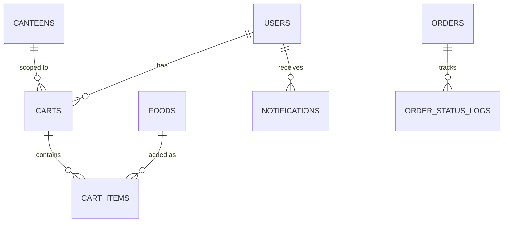
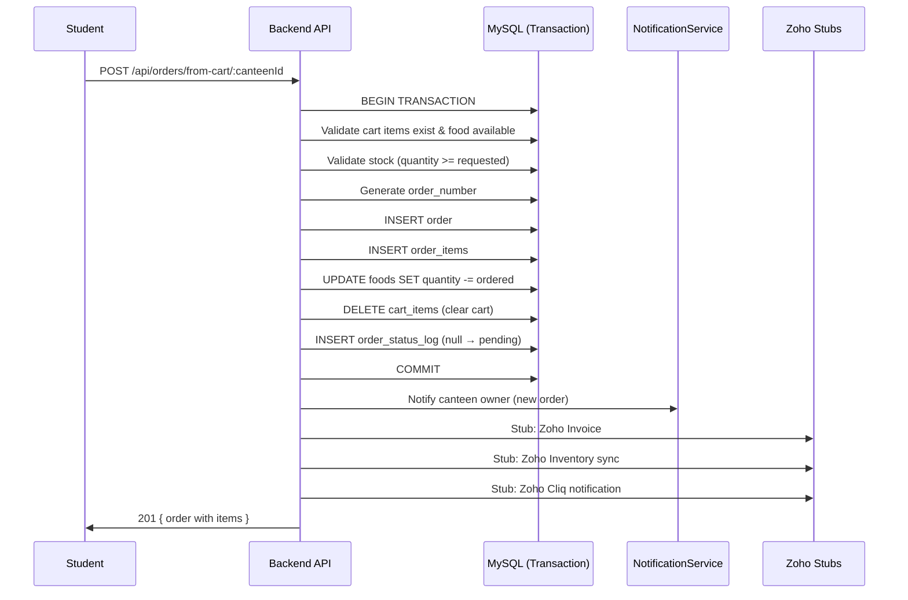

# TASK 3: Cart & Order Processing — Implementation Plan

## Current System State

### What's Already Built

| Module | Status | What Exists |
|--------|--------|-------------|
| **TASK 1: Auth** | ✅ Complete | Users, JWT, RBAC, OTP, login/register |
| **TASK 2: Canteen & Menu** | ✅ Complete | Canteens, foods, food_categories, basic orders/order_items, ownership middleware |

### What TASK 2 Already Has vs What TASK 3 Needs

| Feature | TASK 2 Status | TASK 3 Requirement | Action |
|---------|--------------|---------------------|--------|
| `orders` table | ✅ Exists | Needs `order_number` column | **MODIFY** |
| `order_items` table | ✅ Exists | Sufficient | Keep as-is |
| Order creation | ✅ Basic (no transaction) | DB transaction + inventory | **ENHANCE** |
| Order status update | ✅ Basic | + status logging + notifications | **ENHANCE** |
| Cart system | ❌ Not built | Full cart CRUD | **NEW** |
| Notifications | ❌ Not built | DB-stored notifications | **NEW** |
| Inventory management | ❌ Not built | Deduct/restore on order events | **NEW** |
| Order status logs | ❌ Not built | Audit trail for status changes | **NEW** |
| Zoho Invoice | ❌ Not built | Stub/mock | **NEW** |
| Zoho Inventory | ❌ Not built | Stub/mock | **NEW** |
| Zoho Cliq | ❌ Console.log only | Formalize into service | **ENHANCE** |

> [!IMPORTANT]
> **Key Principle**: TASK 3 enhances the existing order system from TASK 2. No breaking changes — only additions and enhancements to existing files.

---

## Open Questions

> [!IMPORTANT]
> **1. Multi-Canteen Cart**: Can a student have items from **multiple canteens** in a single cart? Or must all items be from **one canteen** per cart?
> - **Option A** (recommended): One cart per canteen — simpler, each order goes to one canteen. If the user wants food from 2 canteens, they have 2 separate carts → 2 separate orders. -- i'd prefer this option
> - **Option B**: Single cart, but checkout creates multiple orders (one per canteen) — more complex.

> [!NOTE]
> **2. Delivery Staff**: TASK 3 mentions `DELIVERING` → `COMPLETED` transitions. Should I include the **delivery staff assignment** flow in this task, or defer it to a future task? (The `sysReq.md` lists "Delivery Staff" as a separate role with its own permissions.) -- include in the tasks

> [!NOTE]
> **3. Notification Delivery**: Notifications will be stored in the DB. Should they also be delivered via:
> - (a) Just DB storage (frontend polls or fetches on page load) — **recommended for now** -- i'd prefer this option
> - (b) WebSocket/SSE for real-time push — defer to future
> - (c) Email via ZeptoMail — defer to future

---

## Proposed Database Schema

### Entity Relationship



### New Tables

#### `carts`
```sql
CREATE TABLE IF NOT EXISTS carts (
  id INT AUTO_INCREMENT PRIMARY KEY,
  user_id INT NOT NULL,
  canteen_id INT NOT NULL,
  created_at TIMESTAMP DEFAULT CURRENT_TIMESTAMP,
  updated_at TIMESTAMP DEFAULT CURRENT_TIMESTAMP ON UPDATE CURRENT_TIMESTAMP,
  FOREIGN KEY (user_id) REFERENCES users(id) ON DELETE CASCADE,
  FOREIGN KEY (canteen_id) REFERENCES canteens(id) ON DELETE CASCADE,
  UNIQUE KEY uk_user_canteen (user_id, canteen_id),
  INDEX idx_user_id (user_id)
);
```

**Design rationale**: `UNIQUE(user_id, canteen_id)` enforces one cart per canteen per user. This avoids multi-canteen order complexity while still allowing a user to "shop" at multiple canteens.

#### `cart_items`
```sql
CREATE TABLE IF NOT EXISTS cart_items (
  id INT AUTO_INCREMENT PRIMARY KEY,
  cart_id INT NOT NULL,
  food_id INT NOT NULL,
  quantity INT NOT NULL DEFAULT 1,
  created_at TIMESTAMP DEFAULT CURRENT_TIMESTAMP,
  updated_at TIMESTAMP DEFAULT CURRENT_TIMESTAMP ON UPDATE CURRENT_TIMESTAMP,
  FOREIGN KEY (cart_id) REFERENCES carts(id) ON DELETE CASCADE,
  FOREIGN KEY (food_id) REFERENCES foods(id),
  UNIQUE KEY uk_cart_food (cart_id, food_id),
  INDEX idx_cart_id (cart_id)
);
```

**Design rationale**: `UNIQUE(cart_id, food_id)` prevents duplicate items — adding the same food twice increments quantity instead.

#### `order_status_logs`
```sql
CREATE TABLE IF NOT EXISTS order_status_logs (
  id INT AUTO_INCREMENT PRIMARY KEY,
  order_id INT NOT NULL,
  from_status VARCHAR(30),
  to_status VARCHAR(30) NOT NULL,
  changed_by INT NOT NULL,
  note VARCHAR(255),
  created_at TIMESTAMP DEFAULT CURRENT_TIMESTAMP,
  FOREIGN KEY (order_id) REFERENCES orders(id) ON DELETE CASCADE,
  FOREIGN KEY (changed_by) REFERENCES users(id),
  INDEX idx_order_id (order_id)
);
```

**Design rationale**: Full audit trail for every status change. `from_status` is NULL for the initial `pending` status. `changed_by` tracks who triggered the transition.

#### `notifications`
```sql
CREATE TABLE IF NOT EXISTS notifications (
  id INT AUTO_INCREMENT PRIMARY KEY,
  user_id INT NOT NULL,
  type ENUM('order_created', 'order_confirmed', 'order_rejected',
            'order_preparing', 'order_delivering', 'order_completed',
            'order_cancelled', 'system', 'inventory_warning') NOT NULL,
  title VARCHAR(200) NOT NULL,
  message TEXT NOT NULL,
  reference_id INT,
  reference_type VARCHAR(50),
  is_read BOOLEAN DEFAULT FALSE,
  created_at TIMESTAMP DEFAULT CURRENT_TIMESTAMP,
  FOREIGN KEY (user_id) REFERENCES users(id) ON DELETE CASCADE,
  INDEX idx_user_id (user_id),
  INDEX idx_is_read (is_read),
  INDEX idx_created_at (created_at)
);
```

**Design rationale**: Polymorphic reference (`reference_id` + `reference_type`) allows linking to any entity (order, canteen, etc.). `is_read` flag enables unread count badge.

### Modify Existing Table

#### `orders` — ADD `order_number` column
```sql
ALTER TABLE orders ADD COLUMN order_number VARCHAR(20) UNIQUE AFTER id;
```

**Format**: `TLU-YYYYMMDD-XXXXX` (e.g., `TLU-20260618-00042`). Generated server-side using date + auto-increment counter.

---

## Proposed Changes

### New Models (4 files)

#### [NEW] [Cart.js](file:///d:/WORK/TLUFood/backend/src/models/Cart.js)
- `findOrCreate(userId, canteenId)` — Upsert: find existing cart or create new one
- `findByUserId(userId)` — Get all carts for a user (with canteen names)
- `findByUserAndCanteen(userId, canteenId)` — Get specific cart
- `findById(id)` — Get cart with canteen info
- `delete(id)` — Delete cart (cascade removes items)

#### [NEW] [CartItem.js](file:///d:/WORK/TLUFood/backend/src/models/CartItem.js)
- `addItem(cartId, foodId, quantity)` — INSERT ON DUPLICATE KEY UPDATE (increment)
- `updateQuantity(id, quantity)` — UPDATE quantity
- `removeItem(id)` — DELETE
- `findByCartId(cartId)` — SELECT with food JOINs (name, price, image, availability)
- `clearCart(cartId)` — DELETE all items for a cart
- `countItems(cartId)` — COUNT for badge

#### [NEW] [Notification.js](file:///d:/WORK/TLUFood/backend/src/models/Notification.js)
- `create(data)` — INSERT
- `findByUserId(userId, { page, limit, isRead })` — Paginated
- `markAsRead(id, userId)` — UPDATE is_read = true (with ownership check)
- `markAllAsRead(userId)` — UPDATE all unread for user
- `getUnreadCount(userId)` — COUNT unread
- `delete(id, userId)` — DELETE (with ownership)

#### [NEW] [OrderStatusLog.js](file:///d:/WORK/TLUFood/backend/src/models/OrderStatusLog.js)
- `create({ orderId, fromStatus, toStatus, changedBy, note })` — INSERT
- `findByOrderId(orderId)` — SELECT ordered by created_at ASC (timeline)

---

### New Services (3 files)

#### [NEW] [cartService.js](file:///d:/WORK/TLUFood/backend/src/services/cartService.js)
- `addToCart(userId, { foodId, quantity })`:
  1. Verify food exists, is available, belongs to active canteen
  2. Verify quantity ≤ available stock
  3. Find or create cart for user + canteen
  4. Add/update cart item (if same food exists, increment quantity)
  5. Return updated cart
- `getCart(userId, canteenId)`: Get cart with items, calculated subtotals and total
- `getMyCarts(userId)`: Get all carts with item counts and totals
- `updateCartItem(userId, cartItemId, quantity)`: Verify ownership, stock, update
- `removeCartItem(userId, cartItemId)`: Verify ownership, remove, delete cart if empty
- `clearCart(userId, canteenId)`: Clear all items, delete cart

#### [NEW] [notificationService.js](file:///d:/WORK/TLUFood/backend/src/services/notificationService.js)
- `createNotification({ userId, type, title, message, referenceId, referenceType })`
- `notifyOrderCreated(order)` — Notify canteen owner(s)
- `notifyOrderStatusChanged(order, newStatus, oldStatus)` — Notify customer
- `notifyInventoryWarning(food)` — Notify canteen owner when stock is low
- `getNotifications(userId, filters)`
- `markAsRead(id, userId)`
- `markAllAsRead(userId)`
- `getUnreadCount(userId)`

#### [NEW] [invoiceService.js](file:///d:/WORK/TLUFood/backend/src/services/invoiceService.js) (STUB)
- `generateInvoice(order)` — Console.log mock; returns fake invoice number
- `// TODO: Zoho Invoice API integration`

---

### New Validations (2 files)

#### [NEW] [cartValidation.js](file:///d:/WORK/TLUFood/backend/src/validations/cartValidation.js)
- `addToCartSchema`: foodId (required, number), quantity (required, number, min 1)
- `updateCartItemSchema`: quantity (required, number, min 1)

#### [NEW] [notificationValidation.js](file:///d:/WORK/TLUFood/backend/src/validations/notificationValidation.js)
- `getNotificationsSchema`: page, limit, isRead (optional boolean)

---

### New Controllers (2 files)

#### [NEW] [cartController.js](file:///d:/WORK/TLUFood/backend/src/controllers/cartController.js)
- `addToCart`, `getCart`, `getMyCarts`, `updateCartItem`, `removeCartItem`, `clearCart`

#### [NEW] [notificationController.js](file:///d:/WORK/TLUFood/backend/src/controllers/notificationController.js)
- `getNotifications`, `getUnreadCount`, `markAsRead`, `markAllAsRead`

---

### New Routes (2 files)

#### [NEW] [cartRoutes.js](file:///d:/WORK/TLUFood/backend/src/routes/cartRoutes.js)
#### [NEW] [notificationRoutes.js](file:///d:/WORK/TLUFood/backend/src/routes/notificationRoutes.js)

---

### Modified Files (4 files)

#### [MODIFY] [orderService.js](file:///d:/WORK/TLUFood/backend/src/services/orderService.js)
Major enhancements:
1. **`createOrder`** — Rewrite to use DB transactions:
   - Begin transaction
   - Validate cart items + stock
   - Generate `order_number` (`TLU-YYYYMMDD-XXXXX`)
   - Create order + order items
   - **Deduct inventory** (`foods.quantity -= ordered_quantity`)
   - Clear the cart
   - Create initial status log entry (`null → pending`)
   - Send notification to canteen owner
   - Stub Zoho Invoice generation
   - Commit (or rollback on error)
2. **`updateOrderStatus`** — Add status logging + notifications:
   - Create OrderStatusLog entry
   - Send notification to customer
   - If cancelled, **restore inventory**
3. **`cancelOrder`** — Add inventory restoration + notification

#### [MODIFY] [Order.js](file:///d:/WORK/TLUFood/backend/src/models/Order.js)
- Add `createWithTransaction(connection, data)` — uses a passed connection (for transaction)
- Add `generateOrderNumber()` — generates `TLU-YYYYMMDD-XXXXX`
- Add `deductInventory(connection, items)` / `restoreInventory(connection, items)`
- Add `findByOrderNumber(orderNumber)` — search by order number

#### [MODIFY] [migrate.js](file:///d:/WORK/TLUFood/backend/src/utils/migrate.js)
- Add CREATE TABLE for: `carts`, `cart_items`, `order_status_logs`, `notifications`
- ALTER TABLE `orders` to add `order_number` column

#### [MODIFY] [app.js](file:///d:/WORK/TLUFood/backend/src/app.js)
- Mount new routes:
  - `app.use('/api/cart', cartRoutes)`
  - `app.use('/api/notifications', notificationRoutes)`

---

## API Endpoints Design

### Cart Routes (`/api/cart`) — 6 endpoints

| Method | Endpoint | Description | Auth | Roles |
|--------|----------|-------------|------|-------|
| `POST` | `/add` | Add item to cart | ✅ | student, lecturer |
| `GET` | `/` | Get all my carts | ✅ | student, lecturer |
| `GET` | `/canteen/:canteenId` | Get cart for specific canteen | ✅ | student, lecturer |
| `PUT` | `/item/:cartItemId` | Update cart item quantity | ✅ | student, lecturer |
| `DELETE` | `/item/:cartItemId` | Remove item from cart | ✅ | student, lecturer |
| `DELETE` | `/canteen/:canteenId` | Clear entire cart | ✅ | student, lecturer |

### Enhanced Order Routes (existing `/api/orders`)

| Method | Endpoint | Description | Change |
|--------|----------|-------------|--------|
| `POST` | `/from-cart/:canteenId` | Create order from cart | **NEW** endpoint |
| All others | ... | Same as TASK 2 | Enhanced with transactions, logging, notifications |

### Notification Routes (`/api/notifications`) — 4 endpoints

| Method | Endpoint | Description | Auth | Roles |
|--------|----------|-------------|------|-------|
| `GET` | `/` | Get my notifications | ✅ | All authenticated |
| `GET` | `/unread-count` | Get unread count | ✅ | All authenticated |
| `PATCH` | `/:id/read` | Mark one as read | ✅ | All authenticated |
| `PATCH` | `/read-all` | Mark all as read | ✅ | All authenticated |

---

## Order Creation Flow (Enhanced)



## Inventory Strategy

| Event | Stock Action | Restore on Cancel? |
|-------|-------------|-------------------|
| Order created | **Deduct** (`quantity -= ordered`) | Yes |
| Order cancelled (by student) | **Restore** (`quantity += ordered`) | N/A |
| Order cancelled (by canteen) | **Restore** (`quantity += ordered`) | N/A |
| Order completed | No change (already deducted) | No |

**Race condition prevention**: Use `SELECT ... FOR UPDATE` within the transaction to lock food rows during stock validation + deduction.

---

## Security Analysis

### Cart Security
- Users can only access their **own** carts (enforced in service layer via `userId`)
- Cart item food must be `available` and from an `active` canteen
- Quantity capped at available stock

### Transaction Security
- Full MySQL transaction for order creation (ACID)
- `SELECT ... FOR UPDATE` to prevent race conditions on stock
- Rollback on any failure

### Notification Security
- Users can only read their **own** notifications (enforced via `userId`)

---

## Zoho Integration Stubs

| Service | Purpose | Implementation |
|---------|---------|---------------|
| **Zoho Invoice** | Generate invoice on order creation | `console.log` mock |
| **Zoho Inventory** | Sync stock changes | `console.log` mock |
| **Zoho Cliq** | Internal notifications (new order, cancel, large order) | `console.log` mock (already exists from TASK 2, formalize) |

---

## Dependencies

No new npm packages needed. All functionality uses existing `mysql2` transactions, `express`, and `joi`.

---

## Verification Plan

### Automated Tests
```bash
# Start server
cd d:\WORK\TLUFood\backend && npm run dev

# Test cart flow
curl -X POST http://localhost:5000/api/cart/add \
  -H "Authorization: Bearer <student_token>" \
  -H "Content-Type: application/json" \
  -d '{"foodId": 1, "quantity": 2}'

# Test checkout from cart
curl -X POST http://localhost:5000/api/orders/from-cart/1 \
  -H "Authorization: Bearer <student_token>" \
  -H "Content-Type: application/json" \
  -d '{"note": "No spicy please"}'

# Test notifications
curl http://localhost:5000/api/notifications \
  -H "Authorization: Bearer <student_token>"

# Verify stock deduction
curl http://localhost:5000/api/foods/1
```

### Manual Verification
- Verify stock deducted after order creation
- Verify stock restored after cancellation
- Verify order_status_logs created on every status change
- Verify notifications sent to correct users
- Verify race condition: two concurrent orders for low-stock item → one should fail
- Verify cart cleared after checkout
